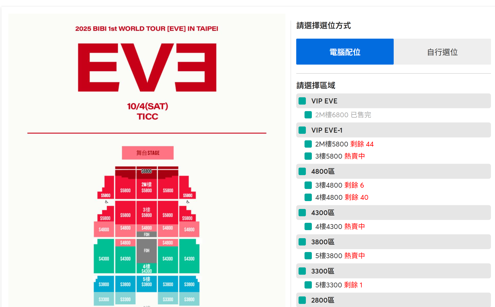
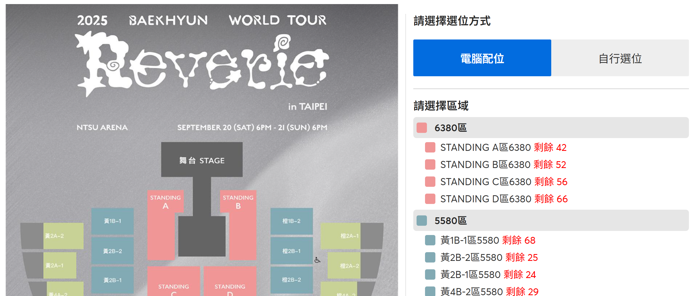
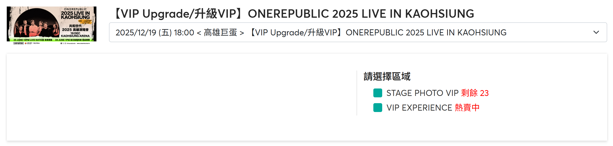
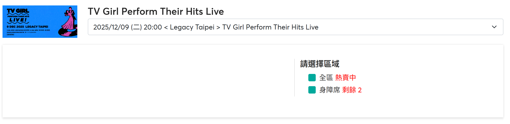
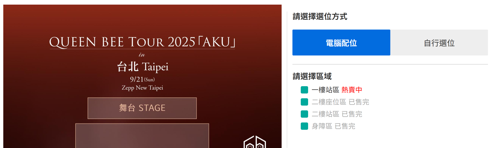
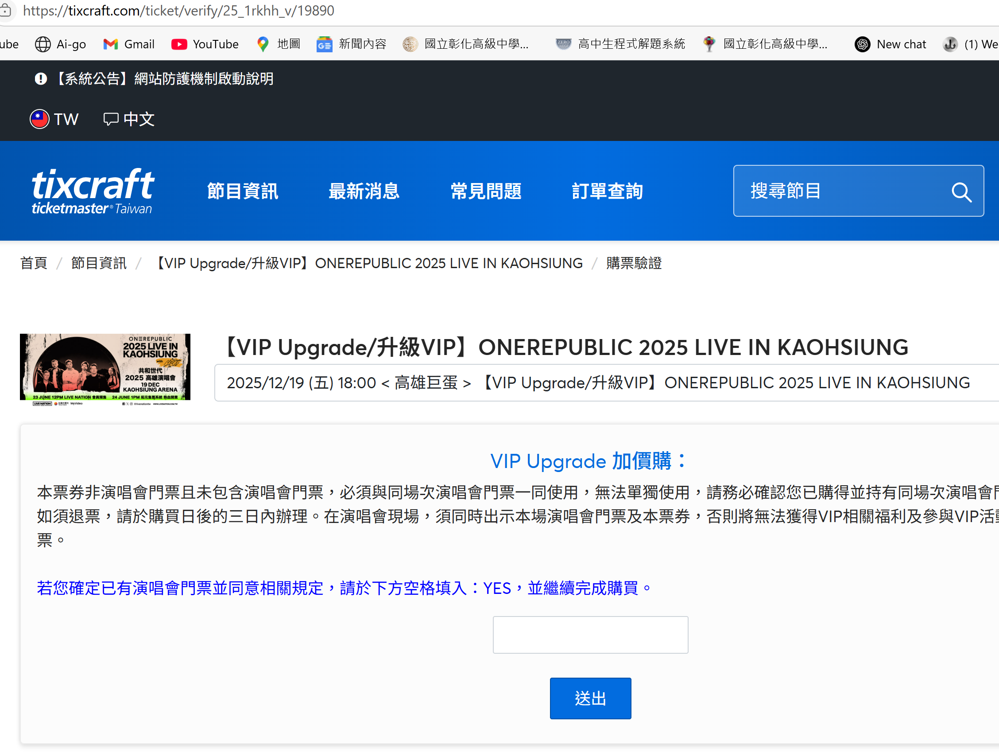
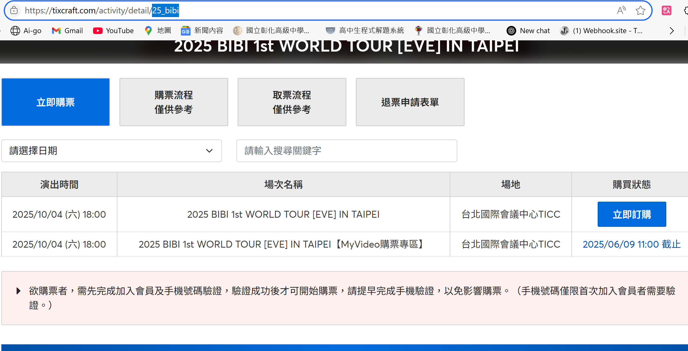
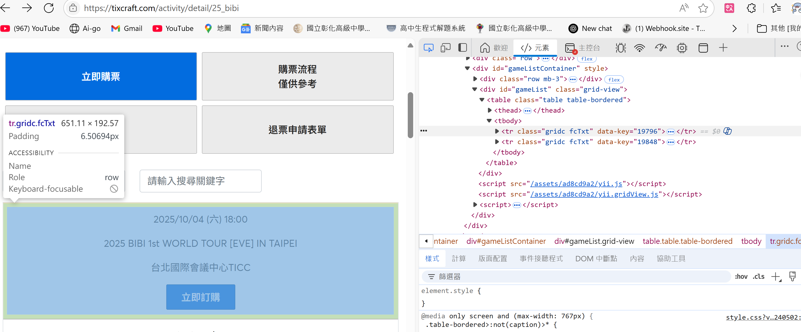
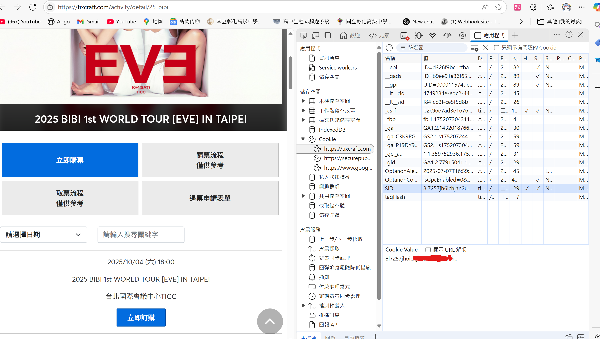

# tixcraft 搶票機器人 by.lemon

## 前提說明

### 支持種類
有分區域的座位




### 不支持種類
若活動並種無分區域將導致程式出錯無法繼續執行







### 可嘗試種類
若活動遇到問題回答，可嘗試購買，有嘗試針對此部分做處理，但不保證能成功。

程式參考以下問題流程，等待使用者輸入問題後，會自動嘗試購買。



## 使用教程

### 1.安裝依賴
```bash
pip install -r requirements.txt
```

### 2. 確定活動名稱代號
活動頁面，複製網址中的活動名稱代號(藍色部分)


ex.   25_bibi

### 3. 確定活動場次ID
按下F12，尋找購票的場次，抓取html中的場次ID(data-key)


ex. 19796

### 4. 取得帳號cookie
登入tixcraft後，按下F12，至「Application」頁籤，尋找cookie

我們要複製SID的值



## Q&A
### Q: 為什麼程式會當掉？
A: 可能是沒有遵照使用教程。

### Q: 為什麼不支持這個功能
A: 因為小檬懶，現在版本已經支持大部分的購票方式。

### Q: 卡住了/我想要這功能，怎麼辦？
A: 私訊小檬，盡可能幫你解決問題。

### Q: 為什麼不能手動登入?一定要cookie?
A: 因為自動化操作瀏覽器且資安問題，google不支援在自動化瀏覽器中登入